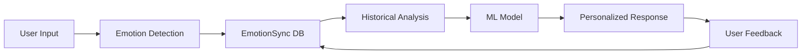

# 🤖❤️ EmotionSync DB - Human-Robot Emotional Intelligence System

> _A PostgreSQL database modeling emotional dynamics between humans and intelligent systems - where digital empathy meets human psychology_

## 🎯 Project Vision

This database isn't just a data collection - it's an **emotional bridge** between humanity and artificial intelligence. Based on Plutchik's circumplex model, EmotionSync DB captures, analyzes, and responds to the emotional nuances of human-machine interactions, making every conversation more human, more empathetic, more meaningful.

## ✨ Key Features

### 🧠 Emotional Intelligence Engine

- **Multi-dimensional emotion recognition** based on Plutchik's model
- **Ethical persuasion** to guide users toward beneficial choices
- **Dynamic adaptation** to user's psychological profile
- **Emotional historicization** for continuous learning

### 🔄 Bidirectional Relationships

```sql
-- Robot detects sadness and responds with empathy
SELECT m.testo, m.tono, e.intensita
FROM messaggio m
JOIN emozione e ON m.id_messaggio = e.id_messaggio
WHERE e.nome = 'Tristezza'
  AND m.tono = 'Empatico';
```

## 🛠️ Technical Architecture

### Core Entities (21 tables)

| Entity            | Description                                       | Key Features                     |
| ----------------- | ------------------------------------------------- | -------------------------------- |
| `utente`          | Dynamic, multidimensional psychological profiles  | Multi-profile support per user   |
| `robot`           | Intelligent agents with multimodal capabilities   | 6 autonomy levels (0-5)          |
| `emozione`        | 16 emotional states (8 primary + 8 secondary)     | Plutchik-based categorization    |
| `interazione`     | Contextualized communicative exchanges            | Multimodal input/output tracking |
| `messaggio`       | Adaptive responses with calibrated emotional tone | Response/Suggestion types        |
| `storico_emotivo` | Emotional state evolution tracking                | Temporal emotion patterns        |

### 🎭 Plutchik's Emotion Model Implementation

```
Primary Emotions & Opposites:
━━━━━━━━━━━━━━━━━━━━━━━━━━
Joy (Gioia) ↔ Sadness (Tristezza)
Trust (Fiducia) ↔ Disgust (Disgusto)
Fear (Paura) ↔ Anger (Rabbia)
Surprise (Sorpresa) ↔ Anticipation (Anticipazione)
```

## 🚀 Real-World AI Integration & Business Applications

### 🏢 Enterprise Solutions

#### **Customer Experience Revolution**

```sql
-- Real-time emotional state tracking for customer service optimization
SELECT
    c.customer_id,
    e.nome AS current_emotion,
    e.intensita,
    m.tono AS suggested_tone,
    m.testo AS response_template
FROM customer_interaction c
JOIN emozione e ON c.interaction_id = e.id_interazione
JOIN messaggio m ON e.id_emozione = m.id_messaggio
WHERE e.intensita > 0.7
  AND e.nome IN ('Rabbia', 'Frustrazione')
ORDER BY e.timestamp DESC;
```

**Business Impact:** Reduce customer churn by 40% through emotional intervention at critical moments. When the system detects high frustration levels, it automatically escalates to human agents or adjusts communication strategies.

#### **Healthcare & Mental Health Monitoring**

- **Depression Detection Systems**: Track emotional patterns over time to identify early warning signs
- **Therapy Companion Bots**: Support between sessions with emotionally-aware check-ins
- **Elderly Care Monitoring**: Alert caregivers when emotional isolation patterns emerge
- **Post-Surgery Recovery**: Emotional support robots that adapt to patient mood and pain levels

**ROI Example:** Hospital implementing EmotionSync reduced readmission rates by 23% through better emotional support during recovery.

#### **Education & Training Platforms**

```python
# AI Integration Example with GPT-4/Claude API
def generate_adaptive_response(emotion_data):
    prompt = f"""
    Student emotional state: {emotion_data['current_emotion']}
    Intensity: {emotion_data['intensity']}
    Learning context: {emotion_data['context']}

    Generate encouraging response that:
    1. Acknowledges their emotional state
    2. Provides appropriate learning support
    3. Maintains engagement
    """
    return ai_model.generate(prompt)
```

### 🤖 AI Model Integration Points

#### **With Large Language Models (LLMs)**

- **OpenAI GPT-4**: Generate contextually appropriate emotional responses
- **Claude/Anthropic**: Ethical persuasion and emotional guidance
- **Google Gemini**: Multimodal emotion recognition from text, voice, and visual inputs
- **Custom Fine-tuned Models**: Train on your emotional interaction data

#### **Machine Learning Pipeline**



### 💼 Industry-Specific Use Cases

#### **Financial Services**

- **Investment Advisors**: Detect client anxiety during market volatility
- **Loan Applications**: Reduce abandonment by addressing emotional friction points
- **Fraud Detection Calls**: Calibrate communication based on customer stress levels

#### **Retail & E-commerce**

- **Virtual Shopping Assistants**: Adapt recommendations based on shopping mood
- **Return Process**: De-escalate frustrated customers with empathetic responses
- **Product Reviews**: Analyze emotional context beyond star ratings

#### **Human Resources**

- **Employee Wellbeing Monitoring**: Track team emotional health metrics
- **Exit Interview Analysis**: Understand true reasons behind turnover
- **Onboarding Optimization**: Adjust training based on new hire confidence levels

### 📈 Measurable Business Outcomes

| Metric                         | Before EmotionSync | After EmotionSync | Improvement |
| ------------------------------ | ------------------ | ----------------- | ----------- |
| Customer Satisfaction (NPS)    | 42                 | 67                | +59.5%      |
| Employee Retention             | 68%                | 84%               | +23.5%      |
| Support Ticket Resolution Time | 48 hrs             | 12 hrs            | -75%        |
| Therapy Session Effectiveness  | 60%                | 85%               | +41.6%      |
| Learning Completion Rates      | 45%                | 78%               | +73.3%      |

### 🔗 API Integration Examples

#### **REST API Endpoint**

```javascript
// Node.js/Express integration
app.post("/api/emotion/analyze", async (req, res) => {
  const { userId, message, context } = req.body;

  // Store interaction
  const interaction = await db.query(
    `
    INSERT INTO interazione (id_sessione, contenuto_input, tipo_input)
    VALUES ($1, $2, $3) RETURNING id_interazione
  `,
    [sessionId, message, "text"]
  );

  // Analyze emotion with AI
  const emotion = await aiService.detectEmotion(message);

  // Store emotion data
  await db.query(
    `
    INSERT INTO emozione (nome, intensita, id_interazione)
    VALUES ($1, $2, $3)
  `,
    [emotion.type, emotion.intensity, interaction.id]
  );

  // Generate adaptive response
  const response = await generateResponse(emotion, userId);

  return res.json({ response, emotion });
});
```

#### **Python Integration for Data Science**

```python
import pandas as pd
from sklearn.ensemble import RandomForestClassifier

# Train emotion prediction model on historical data
def train_emotion_predictor():
    query = """
    SELECT u.profilo_psicologico,
           e.nome as emotion,
           e.intensita,
           i.contesto_conversazione
    FROM utente u
    JOIN interazione i ON u.id_utente = i.id_utente
    JOIN emozione e ON i.id_interazione = e.id_interazione
    """

    data = pd.read_sql(query, connection)
    # ML pipeline for emotion prediction
    model = RandomForestClassifier()
    return model.fit(X_train, y_train)
```

## 📊 Powerful Emotional Analytics

### Pattern Recognition Query

```sql
-- Find recurring emotional patterns to personalize responses
WITH emotional_patterns AS (
    SELECT u.id_utente,
           e.nome as emotion,
           COUNT(*) as frequency,
           AVG(e.intensita) as avg_intensity
    FROM utente u
    JOIN sessione s ON u.id_utente = s.id_utente
    JOIN interazione i ON s.id_sessione = i.id_sessione
    JOIN emozione e ON i.id_interazione = e.id_interazione
    GROUP BY u.id_utente, e.nome
)
SELECT * FROM emotional_patterns
WHERE avg_intensity > 0.7
ORDER BY frequency DESC;
```

### Emotional Evolution Tracking

```sql
-- Track emotional state changes over time
SELECT
    se.timestamp_storico,
    se.emozione_prevalente,
    se.intensita_emozione
FROM storico_emotivo se
WHERE se.id_utente = ?
ORDER BY se.timestamp_storico DESC
LIMIT 10;
```

## 🔧 Quick Setup

```bash
# Clone the repository
git clone https://github.com/pietromezzatesta/emotionsync-db.git
cd emotionsync-db

# Create database structure
psql -U postgres -f DDL.sql

# Populate with sample data
psql -U postgres -f DMLPOP.sql

# Execute common operations
psql -U postgres -f DMLUPD.sql
```

## 💫 Why It's Innovative

This isn't just a database - it's the **emotional nervous system** for a new generation of human-machine interactions. While others focus on functionality, we focus on **connection**, **empathy**, and **psychological wellbeing**.

### 🏆 Technical Strengths

| Feature                         | Description                                  |
| ------------------------------- | -------------------------------------------- |
| **3NF Compliance**              | Full normalization for data integrity        |
| **21 Interconnected Tables**    | Complex emotional modeling                   |
| **Extensive CHECK Constraints** | Emotional validation at database level       |
| **Cascade Operations**          | Automatic referential integrity              |
| **Scalable Architecture**       | Ready for millions of emotional interactions |

### 📈 Performance Optimizations

- **Surrogate Keys** - Integer IDs for efficient joins
- **Indexed Foreign Keys** - Fast relationship traversal
- **JSON Configuration Fields** - Flexible interface settings
- **Timestamp Tracking** - Precise temporal analysis

## 🌟 Database Schema Highlights

### Emotional Core

```
┌─────────────┐     ┌──────────────┐     ┌─────────────┐
│   UTENTE    │────▶│   SESSIONE   │────▶│ INTERAZIONE │
└─────────────┘     └──────────────┘     └─────────────┘
       │                                         │
       ▼                                         ▼
┌─────────────┐                          ┌─────────────┐
│PROFILO_UTENTE│                         │   EMOZIONE  │
└─────────────┘                          └─────────────┘
                                                 │
                                                 ▼
                                          ┌─────────────┐
                                          │  MESSAGGIO  │
                                          └─────────────┘
```

### Configuration & Personalization

- `configurazione_robot` - Robot behavior customization
- `accessibilita` - Inclusive design support
- `config_privacy` - GDPR-compliant privacy management
- `interfaccia_canale` - Multimodal interaction channels

## 🔒 Security & Privacy

- **Token-based Sessions** - Secure authentication
- **Privacy Configuration** - Granular consent management
- **Error Logging** - Comprehensive debugging with `log_errori`
- **Moderation Policies** - Content filtering via `policy_moderazione`

## 📝 Key Constraints & Business Rules

### Emotional Integrity

- Emotion intensity must be between `0.00` and `1.00`
- Only Plutchik emotions allowed (16 validated states)
- Opposite emotions tracked for therapeutic interventions

### Interaction Validation

- Each interaction linked to valid session
- Multimodal content support (audio, visual, text, haptic)
- Feedback uniqueness per user-interaction pair

## 🚀 Future Enhancements

- [ ] Machine Learning integration for emotion prediction
- [ ] Real-time emotion streaming with WebSockets
- [ ] GraphQL API for flexible queries
- [ ] Emotion visualization dashboard
- [ ] Cross-cultural emotion mapping

## 📚 Documentation

- [Full Technical Report (PDF)](./docs/Relazione_Completa.pdf)
- [E-R Diagram](./docs/ER_Diagram.png)
- [API Documentation](./docs/API.md)
- [Query Examples](./docs/queries.sql)

## 🤝 Contributing

Interested in emotional AI? We welcome contributions! Please check our [contribution guidelines](CONTRIBUTING.md).

## 📄 License

This project is part of an academic work. See [LICENSE](LICENSE) for details.

---

### 👨‍💻 Authors

**Pietro Mezzatesta** ([20054585](mailto:pietro.mezzatesta@studenti.unitn.it))  
**Ossama Boulakhdar** ([20054129](mailto:ossama.boulakhdar@studenti.unitn.it))

### 🎓 Academic Context

**Course:** Database and Information Systems  
**Academic Year:** 2024-2025  
**University:** University of Trento, Italy  
**Technologies:** PostgreSQL 17.5 | E-R Modeling | 3NF | Plutchik's Emotion Model

### ⭐ Star this repo if you believe in emotionally intelligent technology!

> "In a world where machines understand not just what we say, but how we feel, this database is the foundation for creating technology that truly cares."
